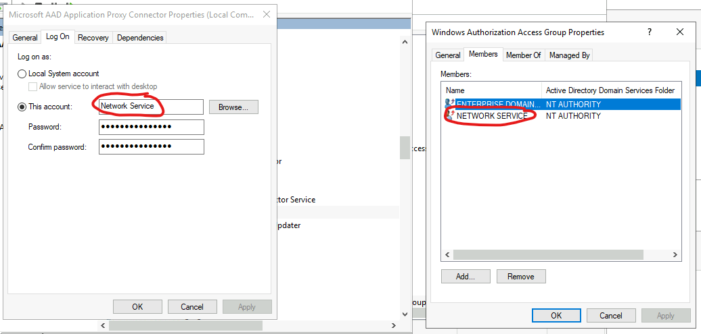

# DemoWebAppUsingKerberos

This is a demo implementation of the [hybrid cloud to on-premises](https://docs.microsoft.com/en-us/azure/active-directory/external-identities/hybrid-cloud-to-on-premises) 
setup for Azure AD App Proxy. You will also need to follow the [instructions](https://docs.microsoft.com/en-us/azure/active-directory/external-identities/hybrid-cloud-to-on-premises) for sharing a B2B user into your tenant, then creating a shadow ID for them in your local AD domain. You will then need to configure Kerberos Constrained Delegation support as defined in this [link](https://docs.microsoft.com/en-us/azure/active-directory/app-proxy/application-proxy-configure-single-sign-on-with-kcd). 

## Architecture


## Deployment instructions

In general, follow the instructions for [setting up Azure AD App Proxy](https://docs.microsoft.com/en-us/azure/active-directory/app-proxy/application-proxy-add-on-premises-application). Here are some additional tips.

### Local AD domain-joined web app server using Integrated Windows Authentication 

1. Create an Service Principal Name (SPN) for your web application. Since the web app is running as the default ApplicationPoolIdentity, this means your SPN
	 should be set to the machine name.

	 ```
	 setspn -R HTTP/vmb2ctenantussd.b2btenant.com vmb2ctenantussd
	 ```

	Verify existence of SPN.

	```
	setspn -Q HTTP/vmb2ctenantussd.b2btenant.com
	```

	Should result in something like the following.
	```
	Checking domain DC=b2btenant,DC=com
	CN=vmb2ctenantussd,OU=Domain Controllers,DC=b2btenant,DC=com
  		    HTTP/vmb2ctenantussd.b2btenant.com
	```

1. Make sure the account that your App Proxy runs under is added to the `Windows Authoriztion Access Group Properties` group in your AD domain.

	 

1. Create the local AD shadow copy of the users you wish to be able to login using the AAD account. In this example, the user is a B2B user (guest) of the 
	 AAD tenant (notice the _microsoft.com#EXE#@jordanbeandemo.onmicrosoft.com). This is the UPN of the user that will be passed to the local AD domain to sign in.

	 

### Azure AD setup

1. Create Enterprise Application

1. Setup **Single sign-on** options

	1. Select **Integrated Windows Authentication**.
	1. Set the **Internal Application SPN** to the one configured on the onprem web server.
	1. Set the **Delegated Login Identity** to **User principal name** if that is what you set as the UPN of the AD shadow account.
	   

1. Setup **Application proxy** options

	1. Set the **Internal Url** to the local path on the web server
	1. Set the **Pre Authentication** to Azure Active Directory to force AAD signin
		 ![enterpriseApplicationApplicationProxyBlade.png]

## References

- https://docs.microsoft.com/en-us/azure/active-directory/app-proxy/application-proxy-configure-single-sign-on-with-kcd
- https://docs.microsoft.com/en-us/azure/active-directory/app-proxy/application-proxy-add-on-premises-application
- https://docs.microsoft.com/en-us/azure/active-directory/external-identities/hybrid-cloud-to-on-premises
- https://docs.microsoft.com/en-us/azure/active-directory/app-proxy/application-proxy-back-end-kerberos-constrained-delegation-how-to
